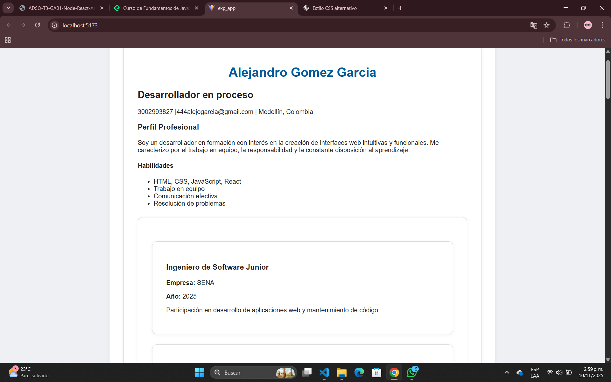
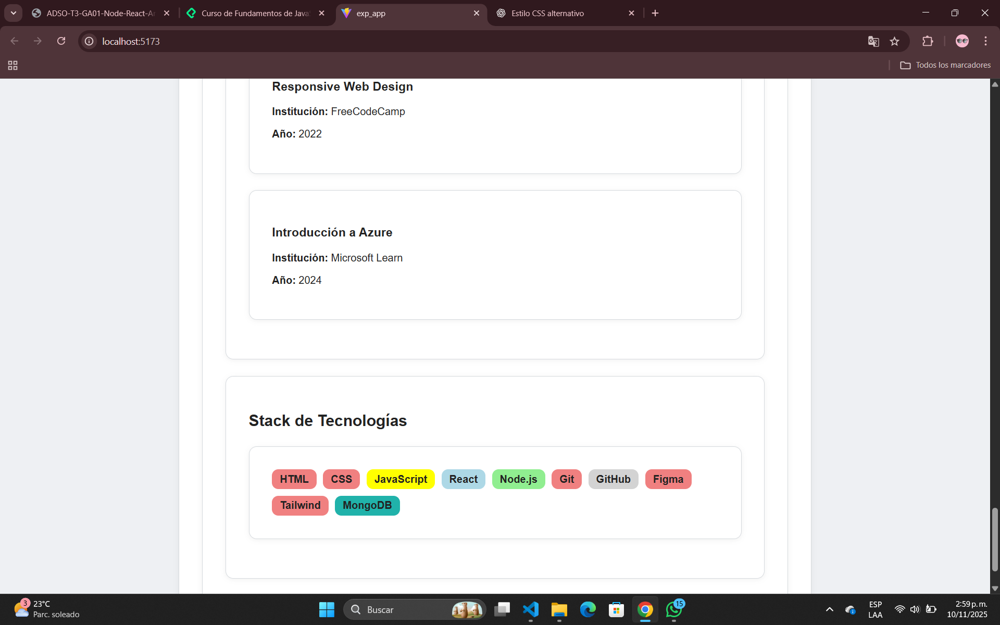

# CV Modular en React – Alejandro Gomez Garcia


Este proyecto consiste en la construcción de una hoja de vida modular desarrollada en React, aplicando el Proyecto de práctica: construcción de componentes dinámicos en React utilizando renderizado condicional y de listas.


##  Cómo ejecutar el proyecto


1. Clonar el repositorio:

   ```bash

   git clone https://github.com/Alejo-081/exp_app.git

## Captura de interfaz grafica



